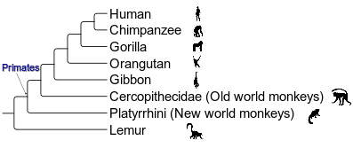

# rrtc
A script to do probability-based relaxed time constraint **(pRTC)**-based dating.

One of the main challenges in molecular dating is the lack of maximum calibrations. To overcome this difficulty, the concept of relative time constrain (RTC) was proposed by using information beyond fossils to provide additional time constraints [1,2] of the **divergence order**, e.g., by forcing the age of a specific node younger than another. This is commonly based on horizontal gene transfer (HGT) that the receipient should originate no earlier than the donor. However, up to now, all approaches that implement RTC treat RTCs as "hard" constraints. This ignores the uncertainty in inference of the divergence order.

This tool named "rrtc" (relaxed RTC) or "prtc" (probability-based RTC) weighted RTCs by their probability inferred by ancestral state reconstruction (ASR) in a **rejection sampling** framework. For example, the last common ancestor (LCA) of symbiont clade 1 may have a probability of 0.7 to be associated with bats, 0.2 with primates, and 0.1 being free-living, as inferred by (ASR). Hence, for any posterior samples of the times inferred by a MCMC molecular dating program, the tool considers the different probabilities of the ancestral hosts (states) and discard the posterior time samples accordingly.

# Installation
Make sure RUBY is installed. Ensure the following RUBY packages have been installed. Otherwise, please use "gem install package_name" to install.
* bio-nwk
* colorize
* parallel
* csv

# Usage
`ruby ~/project/Rhizobiales/scripts/dating/rrtc/do_rrtc.rb --mcmctxt mcmctree/mcmc.txt -i mcmctree/out --rrtc rrtc_folder`
Arguments:
  * `--mcmctxt`: the file "mcmc.txt" generated by MCMCTree
  * `-i`: the file "out" generated by MCMCTree
  * `--rrtc`: the folder that contains the info of all RTCs

The format of the files included in the rrtc_folder should be as follows.

For analysis based on the marginal probability of ancestral states:


```
sym1,sym2 euk1,euk2:0.0037 euk1,euk3:0.9654
sym1,sym3 euk1,euk2:0.9648	euk1,euk3:0.0350
```

The above example indicates that the LCA of sym1 and sym2 is no older than those of eukl & euk2, and euk1 & euk3 (hosts) with a probability of 0.0037 and 0.9654 respectively. You may note that the probabilities in the row do not add up to 1.0, which is because the rest corresponds to the probability of being free-living. You can consider being free-living means the age of the symbiont node should be younder than only the "root" of the tree.

For join probability of ancestral states:

```
sym1,sym2 sym1,sym3
euk1,euk2 euk1,euk2 0.0037
euk1,euk2 euk1,euk3	0.9311
euk1,euk3 euk1,euk2 0.0341
euk1,euk3 root	0.0002
root	euk1,euk2	0.0300
root	euk1,euk3	0.0009
```

The first wor indicates the names of the internal symbiont node which in the above example are sym1&sym2, and sym2&sym3. The remaining rows specify the probabilities that the two symbiont nodes are younger than each of the combinations of the host nodes or being free-living.

# Notes
1. While the host is often given at the species level for a symbiont, you may need to re-define at a higher taxonomic level to make it biologically more meaningly. For example, in case the hosts of the group of symbionts you are studying include `human, gorilla, macaque, tarsier, lemur, dolphin, bat, kangaroo`, you may want to classify the hosts into 2 groups as `primates` (human, gorilla, macaque and tarsier) and `(non-primate) mammals` (all the rest), or into 3 groups as `apes` (human and gorilla), `(non-ape) primates` (macaque and tarsier), and `(non-primate) mammals` (all the rest). How you classify the host species into subgrouyps affects ASR analysis, as different groupings correspond to different data. There is no universal rule of the grouping, but in general, it depends on wether organisms in the same group are **similar** enough and whether organisms from different groups are **different** enough in the context of your analysis.
2. Importantly, note that the ancestral nodes of the symbiont or host have to be defined in the above manner, i.e., to use **any two tips to indicate their LCA**. In this way, `sym1,sym2` and `euk1,euk2` define ancestral nodes of the symbionts and the hosts, repsecitvely. As an example, in the following graph, if you would like to **indicate the crown group of primates, then you could take `euk1` as `Human`, and `euk2` as `Platyrrhini`**. Alternatively, to indicate the crown group of primates, you can also use `Gorilla,Platyrrhini`, or `Gibbon,Platyrrhini`, **but you can NOT simply use "Primates"** in your control file (see `rrtc_examples/marginal/` for example).



All icons of animals are obtained from [PhyloPic](https://www.phylopic.org/).

As another example, for the file `rrtc_examples/marginal/Buchnera.tbl`, `Daphnia_pulex,Drosophila_melanogaster` indicates the total group arthropods (or crown group paranthropods) but you cannot directly use "paraanthropods" in the file `rrtc_examples/marginal/Buchnera.tbl`.

# References
1. Davín, A.A., Tannier, E., Williams, T.A. et al. Gene transfers can date the tree of life. Nat Ecol Evol 2, 904–909 (2018). https://doi.org/10.1038/s41559-018-0525-3
2. Magnabosco C, Moore KR, Wolfe JM, Fournier GP. Dating phototrophic microbial lineages with reticulate gene histories. Geobiology. 2018 Mar;16(2):179-89.


# How to cite

